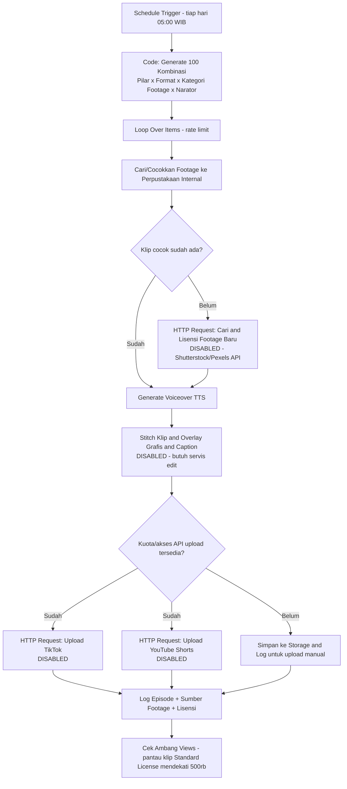

# Rancangan Otomasi n8n — Kopi Sumatra Content Pipeline (Real-Footage)

Dokumen ini merancang alur otomasi dari "generate batch harian" sampai "upload ke TikTok & YouTube
Shorts", memakai **footage nyata berlisensi** (bukan AI text-to-video). Skeleton workflow yang bisa
diimpor ke n8n ada di `workflow-kopi-sumatra.json` (satu folder ini) — semua node yang butuh API
eksternal sengaja **dinonaktifkan (disabled)** dan diberi sticky note karena belum ada kredensial/
keputusan sumber footage dari pengguna. Jangan aktifkan node tersebut sebelum langkah "Yang harus
disiapkan dulu" di bawah selesai.

## Baca ini dulu: tiga batasan nyata sebelum berharap "100 video/hari full-otomatis"

1. **Jatah unduhan footage berlisensi terbatas.** Subscription video Shutterstock hanya memberi
   **5-20 unduhan/bulan** (tidak bisa ditabung ke bulan berikutnya) — jauh di bawah kebutuhan ratusan
   klip/bulan kalau tiap video pakai footage baru. Solusinya **bukan** beli lebih banyak per video,
   tapi bangun **perpustakaan footage reusable** di muka (lihat
   `skills/kopi-sumatra-content/references/sumber-footage-berlisensi.md`) — footage boleh dipakai
   ulang di banyak video di bawah lisensi royalty-free yang sama.
2. **Batas tayang lisensi Standard Shutterstock: 500.000 views per video.** Kalau sebuah video pakai
   klip Standard-license dan berpotensi viral melewati itu, klip tersebut perlu di-upgrade ke
   **Enhanced License**. Workflow perlu langkah pemantauan performa per video untuk menangkap ini
   (lihat node "Cek Ambang Views" di bawah).
3. **Kuota API upload TikTok/YouTube tetap berlaku sama seperti sebelumnya**, tidak berubah oleh
   pivot dari AI-video ke real-footage:
   - **YouTube Data API v3**: kuota default 10.000 unit/hari, `videos.insert` menghabiskan ~1.600
     unit → hanya ±6 upload/hari lewat API tanpa quota increase request.
   - **TikTok Content Posting API**: butuh app review; sebelum lolos, hanya boleh posting
     draft/private ke akun test.

**Implikasi**: fase awal realistisnya berhenti di "generate skrip + shot list + cocokkan footage +
render/edit", sedangkan **upload final tetap manual** lewat TikTok Studio & YouTube Studio sampai
kuota/akses API di atas benar-benar disetujui.

## Arsitektur

## Detail tiap tahap

1. **Schedule Trigger** — jalan sekali sehari (mis. 05:00 WIB) supaya cocokkan footage & edit sempat
   selesai sebelum jadwal upload pertama jam 06:00.

2. **Code: Generate 100 Kombinasi** — port JavaScript dari logika rotasi di
   `skills/kopi-sumatra-content/scripts/generate_batch.py` (pilar × format × kategori-footage ×
   narator, rotasi berbasis tanggal), menghasilkan hook/beat/CTA + shot list berisi **kata kunci
   pencarian footage** (bukan prompt AI).

3. **Loop Over Items (rate limit)** — proses satu video per iterasi.

4. **Cari/Cocokkan Footage ke Perpustakaan Internal** — cek dulu apakah kata kunci shot cocok dengan
   klip yang sudah dimiliki (mis. lookup ke Google Sheet/Airtable berisi katalog footage internal
   dengan tag kata kunci). Ini langkah kunci supaya **tidak** membeli klip baru tiap video.

5. **Cari & Lisensi Footage Baru (kalau belum ada yang cocok)** — panggil API stock footage (mis.
   Shutterstock API kalau sudah berlangganan, atau Pexels API untuk opsi CC0 gratis). Hasil baru ini
   ditambahkan ke katalog perpustakaan internal supaya bisa dipakai ulang video-video berikutnya.

6. **Generate Voiceover (TTS)** — panggil API text-to-speech (mis. ElevenLabs) dari naskah
   hook/beat/CTA. Biaya kecil per video (lihat `automation/estimasi-biaya-produksi.md`).

7. **Stitch Klip + Overlay + Caption** — n8n sendiri tidak punya kemampuan native edit video; butuh
   layanan eksternal (Shotstack, Creatomate, atau microservice ffmpeg sendiri) untuk menyambung
   2-3 klip B-roll + voiceover + caption burned-in + **overlay grafis/data** (wajib, lihat catatan
   reused-content di `references/platform-guidelines.md`).

8. **Cabang kuota**: selama akses upload API belum disetujui, video hasil disimpan ke storage
   (Google Drive/S3) dan dicatat di spreadsheet supaya tim bisa upload manual dengan metadata yang
   sudah disiapkan otomatis (lihat `templates/metadata-template.md`).

9. **Log Episode** — catat setiap episode (index, pilar, format, kategori footage, narator, ID klip
   yang dipakai + jenis lisensinya, status upload, link video) ke Google Sheet/Airtable.

10. **Cek Ambang Views** — job terpisah (mis. jalan mingguan) yang menarik statistik views per video
    dari TikTok/YouTube API dan membandingkan dengan klip Standard-license yang dipakai; kalau
    mendekati 500.000 views, beri notifikasi untuk upgrade lisensi klip tersebut ke Enhanced.

## Yang harus disiapkan dulu sebelum node API diaktifkan

- [ ] Bangun katalog awal perpustakaan footage (mulai dari CC0/Pexels dulu untuk validasi format,
      lalu tambah Shutterstock/footage sendiri untuk kualitas & keunikan) — lihat
      `skills/kopi-sumatra-content/references/sumber-footage-berlisensi.md`.
- [ ] Siapkan spreadsheet/database katalog footage (kata kunci, sumber, jenis lisensi, tanggal pakai
      terakhir, akumulasi views video yang memakainya).
- [ ] Pilih & daftar API TTS (ElevenLabs atau alternatif) + API key.
- [ ] Pilih layanan stitching/video-editing (atau bangun microservice ffmpeg sendiri).
- [ ] Daftarkan aplikasi TikTok for Developers, lalui app review, siapkan OAuth per akun TikTok.
- [ ] Daftarkan project Google Cloud, aktifkan YouTube Data API v3, siapkan OAuth, dan ajukan
      quota increase kalau target benar-benar >6 upload/hari lewat API.
- [ ] Siapkan storage (Drive/S3) + spreadsheet log untuk fase transisi sebelum upload API aktif.

Setelah semua ini siap dan pengguna mengonfirmasi kredensialnya, workflow di `workflow-kopi-sumatra.json`
bisa diimpor ke n8n dan node-node yang relevan tinggal diaktifkan + diisi kredensialnya satu per satu.
