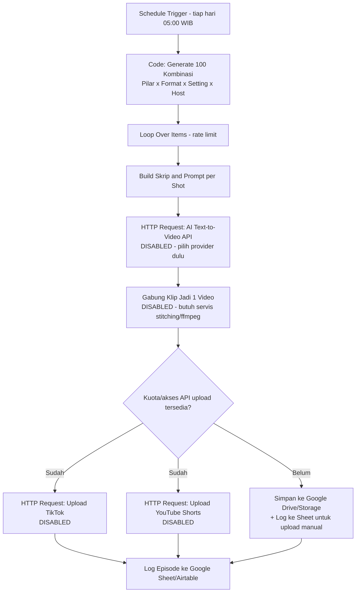

# Rancangan Otomasi n8n — Kopi Sumatra Content Pipeline

Dokumen ini merancang alur otomasi dari "generate batch harian" sampai "upload ke TikTok & YouTube
Shorts". Skeleton workflow yang bisa diimpor ke n8n ada di `workflow-kopi-sumatra.json` (satu folder
ini) — semua node yang butuh API eksternal sengaja **dinonaktifkan (disabled)** dan diberi sticky note
karena belum ada kredensial/keputusan provider dari pengguna. Jangan aktifkan node tersebut sebelum
langkah "Yang harus disiapkan dulu" di bawah selesai.

## Baca ini dulu: batasan nyata sebelum berharap "100 video/hari full-otomatis"

Sebelum membangun otomasi penuh, dua batasan platform ini **akan menggagalkan target 100 upload/hari**
kalau tidak diantisipasi dari awal:

1. **YouTube Data API v3 punya kuota harian default 10.000 unit**, dan satu panggilan
   `videos.insert` (upload video) menghabiskan **~1.600 unit**. Artinya default akun hanya bisa
   upload **±6 video/hari** lewat API — jauh dari 100. Untuk lebih dari itu, harus mengajukan
   **quota increase request** ke Google (butuh proses audit, tidak instan, dan tidak dijamin disetujui
   untuk kasus penggunaan volume tinggi seperti ini).
2. **TikTok Content Posting API** mengharuskan aplikasi didaftarkan & melalui **app review**. Sebelum
   lolos audit, aplikasi biasanya hanya boleh posting sebagai **draft/private** ke akun test, bukan
   publish publik langsung, dan ada rate limit tersendiri per developer app.

**Implikasi**: fase awal otomasi realistisnya berhenti di "generate skrip + prompt + render video AI",
sedangkan **upload final tetap manual lewat TikTok Studio & YouTube Studio** (atau dijadwalkan lewat
fitur scheduling bawaan mereka) sampai kuota/akses API di atas benar-benar disetujui. Rancangan di
bawah tetap menyertakan node upload API supaya siap dipakai begitu akses tersedia, tapi jangan asumsikan
itu bisa jalan hari pertama.

## Arsitektur

## Detail tiap tahap

1. **Schedule Trigger** — jalan sekali sehari (mis. 05:00 WIB) supaya render & review sempat selesai
   sebelum jadwal upload pertama jam 06:00.

2. **Code: Generate 100 Kombinasi** — port JavaScript dari logika rotasi di
   `skills/kopi-sumatra-content/scripts/generate_batch.py` (pilar × format × setting × host, rotasi
   berbasis tanggal). Alternatif lebih sederhana: panggil script Python itu langsung lewat node
   **Execute Command** kalau n8n instance-nya self-hosted dan boleh eksekusi shell; kalau n8n cloud,
   port ke JS di node Code seperti di skeleton JSON.

3. **Loop Over Items (rate limit)** — proses satu video per iterasi dengan jeda (node `Wait`) di
   antaranya, supaya tidak membanjiri API AI video-gen atau kena rate limit.

4. **Build Skrip & Prompt per Shot** — menyusun hook/beat/CTA dan prompt video per shot dari
   `templates/prompt-video-template.md` & `references/gaya-visual-anime.md` (deskripsi karakter/
   setting disalin persis, tidak diparafrase ulang, supaya konsisten).

5. **HTTP Request: AI Text-to-Video** — placeholder generik. Provider yang dipilih pengguna
   (mis. Runway, Kling, Pika, Luma, Google Veo, dll.) menentukan endpoint, auth, dan format response
   (biasanya asynchronous: submit job → poll status → download hasil). Sesuaikan node ini begitu
   provider dipilih.

6. **Gabung Klip Jadi Video Final** — n8n sendiri tidak punya kemampuan native edit video/stitching;
   butuh layanan eksternal (mis. Shotstack, Creatomate, atau microservice ffmpeg sendiri) untuk
   menyambung 2-5 klip + menambahkan caption burned-in + voiceover. Ini komponen yang paling perlu
   dirancang terpisah sebelum otomasi penuh jalan.

7. **Cabang kuota**: selama akses upload API belum disetujui, video hasil disimpan ke storage
   (Google Drive/S3) dan dicatat di spreadsheet supaya tim bisa upload manual lewat TikTok Studio/
   YouTube Studio dengan metadata yang sudah disiapkan otomatis (lihat
   `templates/metadata-template.md`).

8. **Log Episode** — catat setiap episode (index, pilar, format, setting, host, status upload,
   link video) ke Google Sheet/Airtable — ini juga jadi sumber data untuk menganalisis performa per
   pilar/format seperti disarankan di `references/platform-guidelines.md`.

## Yang harus disiapkan dulu sebelum node API diaktifkan

- [ ] Pilih provider AI text-to-video (dan pastikan gaya anime/cartoon konsisten dengan
      `gaya-visual-anime.md` bisa dicapai providernya) + API key.
- [ ] Pilih layanan stitching/video-editing (atau bangun microservice ffmpeg sendiri).
- [ ] Daftarkan aplikasi TikTok for Developers, lalui app review, siapkan OAuth per akun TikTok.
- [ ] Daftarkan project Google Cloud, aktifkan YouTube Data API v3, siapkan OAuth, dan ajukan
      quota increase kalau target benar-benar >6 upload/hari lewat API.
- [ ] Siapkan storage (Drive/S3) + spreadsheet log untuk fase transisi sebelum upload API aktif.

Setelah semua ini siap dan pengguna mengonfirmasi kredensialnya, workflow di `workflow-kopi-sumatra.json`
bisa diimpor ke n8n dan node-node yang relevan tinggal diaktifkan + diisi kredensialnya satu per satu.
